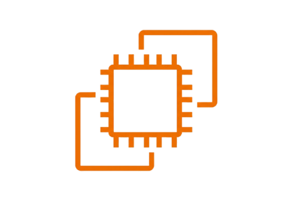
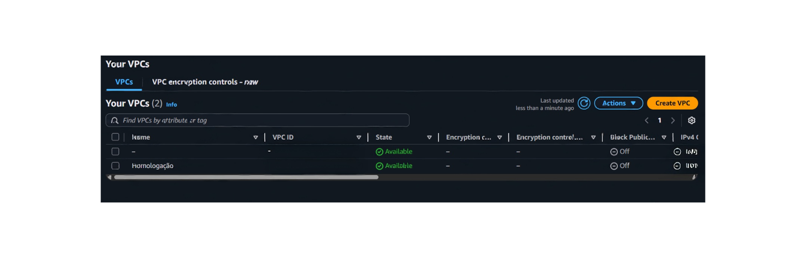
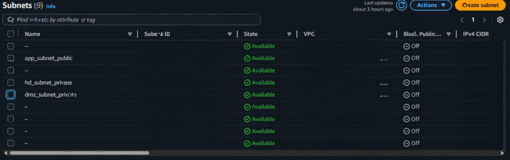

# 👩🏾‍💻 Infraestrutura como Código - AWS

  

  

  

  

  

# 📌 Descrição
Este é um projeto inicial para a construção de uma infraestrutura simples na AWS.

# 🛠️ Instruções de instalação
Este projeto não contemplará a parte de instruções de instalação. Como se trata de recursos provisionados em cloud, os mesmos serão descomissionados para não gerar custos recorrentes. A aplicação será demonstrada através de prints.

# 🤖 Informações técnicas
Para a realização deste projeto, as seguintes tecnologias-chave foram empregadas:

## Terraform
Ferramenta de Infraestrutura como Código (IaC) que permite definir e provisionar recursos de nuvem (AWS, no caso deste projeto).

## AWS VPC
Rede virtual privada isolada dentro da AWS Cloud, onde é possível lançar recursos AWS e ter controle total sobre o seu ambiente de rede.

### OBS:
    Os dados de id e IPv4 foram apagados por questões de segurança.

  

## AWS Subnet
Subdivisão da VPC, que permite segmentar a rede em zonas para controlar o acesso e a segurança (público ou privado).

### OBS:
    Os dados de id e IPv4 foram apagados por questões de segurança.

  

## AWS EC2
Recurso que fornece capacidade computacional redimensionável na nuvem, permitindo larçar servidores virtuais (instâncias) para hospedar aplicativos.

# ✨ Autora

[ Jessica Oliveira](https://github.com/jessicaalines)

# 📥 Contato

Via LinkedIn:

* Jessica Oliveira: https://www.linkedin.com/in/jessica-aline-soares-oliveira/

# 💙 Agradecimentos

Ao Daniel Medeiros, por ser o pregador da palavra do Terraform!

